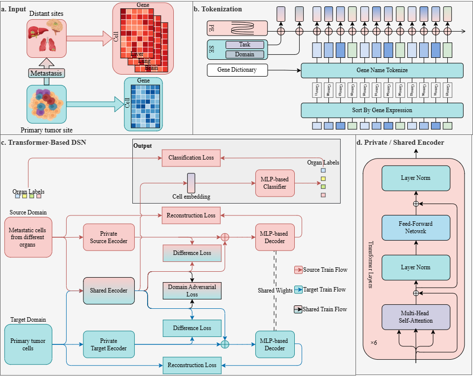

# TOMIC

This is the official codebase for **TOMIC: A Transformer-based Domain Separation Network for Organ-specific Metastasis-Initiating Cell Identification**.

[](LICENSE)

## Overview

**TOMIC** is a **T**ransformer-based domain separation network (DSN) for **O**rgan-specific **M**etastasis-**I**nitiating **C**ell (MIC) identification from primary tumor cells.

Metastasis-initiating cells (MICs) are a rare subpopulation of tumor cells capable of seeding and establishing secondary tumors in distant organs. Understanding and identifying organ-specific MICs is critical for determining metastatic tropism and patient prognosis, and they represent potential targets for therapeutic intervention. However, the precise identification of MICs remains challenging due to cellular heterogeneity within primary tumors, and the complex interplay between tumor cells and the microenvironment of distinct metastatic organs.

TOMIC addresses this challenge by leveraging paired primary tumor and metastatic multi-organ cells, where metastatic tumor cells serve as the labeled source domain and primary tumor single cells serve as the unlabeled target domain. The model aligns the source and target domains through shared feature extraction while separating domain-specific features, enabling an organ-specific classifier trained on the source domain to accurately predict organ-specific MICs in the primary tumor cells.



**Figure 1: Overview of TOMIC approach.** **a.** Input data includes scRNA-seq gene expression profiles from distant metastatic cells across multiple organs and paired primary tumor cells. **b.** Ranked gene name-based tokenization strategy, in which genes are ordered by within-cell expression magnitude to form a deterministic token sequence. **c.** Architecture of the Transformer-based domain separation network. **d.** The transformer encoder used in the TOMIC approach.

## Key Features

- **Domain Separation Network (DSN)**: Separates domain-shared and domain-private features to enable effective domain adaptation
- **Multiple Model Architectures**: Supports MLP, Patch Transformer, Expression Transformer, Name Transformer, and Dual Transformer models
- **Multiple Domain Adaptation Methods**: Implements DSN, DANN (Domain Adversarial Neural Network), and ADDA (Adversarial Discriminative Domain Adaptation)
- **Ranked Gene Name-based Tokenization**: Genes are ordered by within-cell expression magnitude to form a deterministic token sequence
- **Comprehensive Evaluation**: Evaluation on both synthetic datasets with gold-standard labels and real paired metastasis datasets with silver-standard labels

## Installation

TOMIC works with Python >= 3.12 and CUDA >= 12.8. Please make sure you have the correct version of Python and CUDA installed.

### Quick Install

1. Clone the repository:

```bash
git clone https://github.com/Foursheeps/TOMIC.git
cd TOMIC
```

1. Create and activate the conda environment:

```bash
conda env create -f environment.yml
conda activate tomic
```

### Requirements

**Python environment:**

- Python 3.12 (tested with Python 3.12.11)
- CUDA 12.8 (tested with CUDA 12.8)
- Conda or Miniconda
- PyTorch 2.8.0
- PyTorch Lightning 2.5.5
- transformers 4.57.0
- scanpy 1.11.4
- anndata 0.12.2
- scikit-learn 1.7.2
- numpy 2.2.6
- pandas 2.3.3
- scipy 1.16.2
- flash-attn 2.8.3 (optional, recommended for faster training)

**R environment (for bioinformatics analysis):**

- R >= 3.6.1
- Required R packages: Seurat, dplyr, ggplot2, readr, purrr, future

To install R packages:

```r
install.packages(c("dplyr", "ggplot2", "readr", "purrr", "future"))
if (!requireNamespace("BiocManager", quietly = TRUE))
    install.packages("BiocManager")
BiocManager::install("Seurat")
```

## Quick Start

### Data Preparation

- **Download processed data**: Processed datasets are available from [Google Drive](https://drive.google.com/drive/folders/1FWPz5vch_eleUW_2JuAlbzmiIHmwcsS5?usp=sharing)

- if you want to test the model from scratch, you can download the raw data and process it yourself.

    1. **Download raw data** (optional): Raw datasets are available from NCBI GEO:
  - [GSE173958](https://www.ncbi.nlm.nih.gov/geo/query/acc.cgi?acc=GSE173958)
  - [GSE249057](https://www.ncbi.nlm.nih.gov/geo/query/acc.cgi?acc=GSE249057)
  - [GSE123902](https://www.ncbi.nlm.nih.gov/geo/query/acc.cgi?acc=GSE123902)
  - [GSE163558](https://www.ncbi.nlm.nih.gov/geo/query/acc.cgi?acc=GSE163558)

    1. **Process raw data** (optional): Use the scripts in `process_data/` to process raw datasets:

    ```bash
    python process_data/create_syncdata.py
    python process_data/process_GSE173958.py
    python process_data/process_GSE123902.py
    python process_data/process_GSE163558.py
    ```

### Training

#### Minimal Example

We provide a minimal example script (`example_train.py`) that demonstrates how to train TOMIC models with a simple Python script. This is the easiest way to get started.

**Quick start:**

1. Edit `example_train.py` to configure your paths:

   ```python
   data_path = Path("/path/to/your/data")
   output_dir = Path("/path/to/output")
   ```

2. Modify the model type and training parameters as needed:

   ```python
   model_type = "name"  # Choose: "mlp", "patch", "expr", "name", or "dual"
   ```

3. Run the script:

   ```bash
   python example_train.py
   ```

The script will:

- Load data configuration from `info_config.json`
- Train a TOMIC model using DSN (Domain Separation Network)
- Save checkpoints and logs automatically
- Test the trained model and display results

**Features:**

- Supports all model types: MLP, Patch, Expression, Name, and Dual Transformer
- Supports multiple training methods: DSN, DANN, ADDA, and standard supervised learning
- Includes detailed comments and documentation
- Automatically saves test results to JSON file

For more details, see the comments in `example_train.py`.

#### One-Click Training Scripts

We provide convenient one-click training scripts in the `scripts/` directory that handle both data processing and training automatically. These scripts are pre-configured for specific datasets and can run multiple training methods (DSN, DANN, ADDA, and standard supervised learning) sequentially.

**Available scripts:**

- **Real datasets:**
  - `GSE173958_M1_1200.sh` - GSE173958 dataset with 1200 highly variable genes
  - `GSE123902_1200.sh` - GSE123902 dataset with 1200 highly variable genes
  - `GSE163558_1200.sh` - GSE163558 dataset with 1200 highly variable genes
  - `GSE249057_2000.sh` - GSE249057 dataset with 2000 highly variable genes

- **Synthetic datasets:**
  - `C120000G14000H1200S10C1.sh` - Synthetic dataset configuration 1
  - `C120000G14000H1200S10C2.sh` - Synthetic dataset configuration 2

**Usage:**

1. Edit the script to configure paths and parameters:
   - Set `PYTHON` path to your Python interpreter
   - Set `DATA_PATH` to your data directory
   - Set `RAW_DATA_DIR` if processing raw data
   - Configure training parameters (batch size, learning rate, etc.)
   - Choose which training methods to run (`RUN_DSN`, `RUN_DANN`, `RUN_ADDA`, `RUN_USUAL`)

2. Run the script:

```bash
bash scripts/GSE173958_M1_1200.sh
```

These scripts will:

- Process raw data (if needed) or use existing processed data
- Train multiple model architectures (MLP, Patch, Expression, Name, Dual)
- Run multiple domain adaptation methods (DSN, DANN, ADDA) and standard supervised learning
- Save checkpoints and logs automatically

#### DSN (Domain Separation Network) Training

The main training script for DSN models is `train_val_scripts/main_dsn.py`. You can use the provided shell script template:

```bash
# Edit run_dsn_template.sh to set your paths
bash train_val_scripts/run_dsn_template.sh
```

Or run directly with Python:

```bash
python train_val_scripts/main_dsn.py \
    --train_models "['mlp', 'patch', 'expr', 'name', 'dual']" \
    --data_path /path/to/your/data \
    --default_root_dir /path/to/output \
    --run_training 1 \
    --run_testing 1 \
    --devices 2 \
    --train_batch_size 256 \
    --max_epochs 80 \
    --patience 10 \
    --patch_size 40 \
    --bingings "[None, 50]"
```

#### Model Types

- **mlp**: Multi-layer perceptron baseline
- **patch**: Patch-based Transformer model
- **expr**: Expression-based Transformer model
- **name**: Gene name-based Transformer model (ranked tokenization)
- **dual**: Dual Transformer model combining name and expression features

#### Other Training Methods

Similar scripts are available for other domain adaptation methods:

- **DANN**: `train_val_scripts/main_dann.py` / `run_dann_template.sh`
- **ADDA**: `train_val_scripts/main_adda.py` / `run_adda_template.sh`
- **Standard Supervised**: `train_val_scripts/main_usual.py` / `run_usual_template.sh`

### Testing

To test a trained model:

```bash
python train_val_scripts/main_dsn.py \
    --data_path /path/to/your/data \
    --default_root_dir /path/to/output \
    --run_training 0 \
    --run_testing 1 \
    --checkpoint_path /path/to/checkpoint.ckpt \
    --train_models "['name']"
```

### Bioinformatics Analysis

After training and prediction, R scripts are provided in the `R/` directory for downstream bioinformatics analysis:

#### Differential Expression Gene (DEG) Analysis

`R/DEG_analysis.R` performs differential expression analysis on predicted MICs:

- Evaluates prediction accuracy on source domain (metastatic cells)
- Performs DEG analysis for each predicted organ-specific MIC class
- Generates volcano plots for visualization
- Outputs DEG results for each class

**Usage:**

```r
# Edit paths in the script
source("R/DEG_analysis.R")
```

**Requirements:**

- R >= 3.6.1
- Seurat
- dplyr
- ggplot2
- readr
- purrr

#### Single-Cell Data Integration

`R/GSE249057_integration.R` performs single-cell data integration and analysis:

- Reads and integrates multiple timepoint samples
- Quality control and filtering
- Normalization and batch correction using Seurat integration
- Dimensionality reduction (PCA, UMAP)
- Clustering analysis
- Time-course analysis

**Usage:**

```r
# Edit paths in the script
source("R/GSE249057_integration.R")
```

**Requirements:**

- R >= 3.6.1
- Seurat
- ggplot2
- dplyr
- future

## Project Structure

```
TOMIC/
├── tomic/                      # Main package
│   ├── dataset/                # Data loading and preprocessing
│   │   ├── abc.py              # Base dataset classes
│   │   ├── dataconfig.py       # Data configuration
│   │   ├── dataset4da.py       # Domain adaptation datasets
│   │   ├── dataset4common.py   # Common datasets
│   │   └── preprocessing.py    # Data preprocessing utilities
│   ├── model/                  # Model architectures
│   │   ├── dsn/                # Domain Separation Network models
│   │   ├── dann/               # Domain Adversarial Neural Network models
│   │   ├── adda/               # Adversarial Discriminative Domain Adaptation models
│   │   ├── usual/              # Standard supervised learning models
│   │   └── encoder_decoder/    # Encoder-decoder architectures
│   ├── train/                  # Training scripts
│   │   ├── dsn/                # DSN training configuration
│   │   ├── dann/               # DANN training configuration
│   │   ├── adda/               # ADDA training configuration
│   │   └── usual/              # Standard training configuration
│   ├── utils.py                # Utility functions for metrics computation
│   └── logger.py               # Logging utilities
├── example_train.py            # Minimal example training script
├── train_val_scripts/          # Main training scripts
│   ├── main_dsn.py             # DSN training entry point
│   ├── main_dann.py            # DANN training entry point
│   ├── main_adda.py            # ADDA training entry point
│   ├── main_usual.py           # Standard training entry point
│   └── run_*_template.sh       # Shell script templates
├── scripts/                    # One-click training scripts
│   ├── GSE173958_M1_1200.sh   # GSE173958 dataset training script
│   ├── GSE123902_1200.sh      # GSE123902 dataset training script
│   ├── GSE163558_1200.sh      # GSE163558 dataset training script
│   ├── GSE249057_2000.sh      # GSE249057 dataset training script
│   └── C*.sh                   # Synthetic dataset training scripts
├── process_data/               # Data processing scripts
│   ├── process_GSE173958.py    # Process GSE173958 dataset
│   ├── process_GSE123902.py    # Process GSE123902 dataset
│   ├── process_GSE163558.py    # Process GSE163558 dataset
│   └── create_syncdata.py      # Create synthetic data
├── R/                          # Bioinformatics analysis scripts
│   ├── DEG_analysis.R          # Differential expression gene analysis
│   └── GSE249057_integration.R # Single-cell data integration analysis
├── tests/                      # Unit tests
├── assests/                    # Figures and assets
├── environment.yml             # Conda environment configuration
└── pyproject.toml              # Project configuration
```

## Model Architecture

TOMIC implements a Domain Separation Network with the following components:

1. **Shared Encoder**: Extracts domain-invariant features from both source and target domains
2. **Private Encoders**: Extract domain-specific features for source and target domains separately
3. **Reconstructor**: Reconstructs original input from combined shared and private features
4. **Classifier**: Organ-specific classifier trained on source domain features
5. **Domain Discriminator**: Distinguishes between source and target domains (for DANN loss)

The model uses Transformer encoders with different tokenization strategies:

- **Name-based**: Genes ordered by expression magnitude
- **Patch-based**: Expression values divided into patches
- **Expression-based**: Direct expression value encoding
- **Dual**: Combines name and expression features

## Data Configuration

The data directory should contain an `info_config.json` file with the following structure:

```json
{
  "class_map": {
    "Liver": 0,
    "Lung": 1,
    "Met": 2
  },
  "seq_len": 1200,
  "num_classes": 3,
  "raw_data_path": "/path/to/raw_data"
}
```

## Evaluation Metrics

The model reports the following metrics:

- **Accuracy**: Overall classification accuracy
- **AUC**: Area under the ROC curve (binary) or macro-averaged AUC (multi-class)
- **F1 Score**: Macro, micro, and weighted F1 scores

## Data Availability

- **Synthetic data generation scripts** and data preprocessing pipeline: [GitHub Repository](https://github.com/Foursheeps/TOMIC)
- **Raw datasets**: Available via [NCBI GEO](https://www.ncbi.nlm.nih.gov/geo/)
- **Processed datasets**: Available for download from [Google Drive](https://drive.google.com/drive/folders/1FWPz5vch_eleUW_2JuAlbzmiIHmwcsS5?usp=sharing)

## Acknowledgements

We sincerely thank the authors of following open-source projects:

- [DSN](https://github.com/fungtion/DSN) - Domain Separation Network
- [PyTorch](https://pytorch.org/) and [PyTorch Lightning](https://www.pytorchlightning.ai/) - Deep learning framework
- [scanpy](https://scanpy.readthedocs.io/) and [anndata](https://anndata.readthedocs.io/) - Single-cell data analysis
- [transformers](https://huggingface.co/docs/transformers) - Transformer models and utilities
- [scikit-learn](https://scikit-learn.org/) - Machine learning utilities
- [Seurat](https://satijalab.org/seurat/) - Single-cell RNA-seq analysis toolkit (R)

## Contact

For questions, issues, or contributions, please:

- Open an issue on the [GitHub repository](https://github.com/Foursheeps/TOMIC)
- Contact the repository owner: [luoyang@stu.xidian.edu.cn](mailto:luoyang@stu.xidian.edu.cn)

We welcome feedback, bug reports, and contributions!
